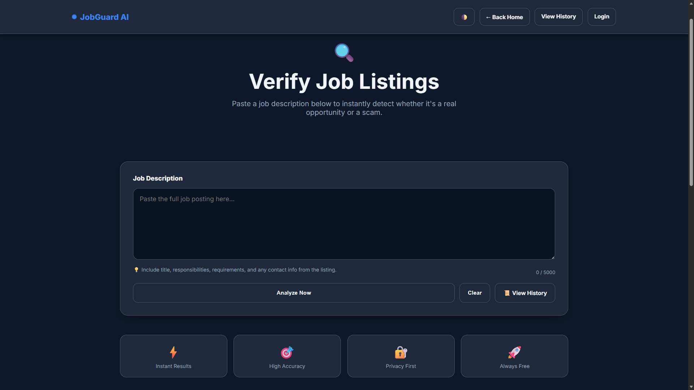
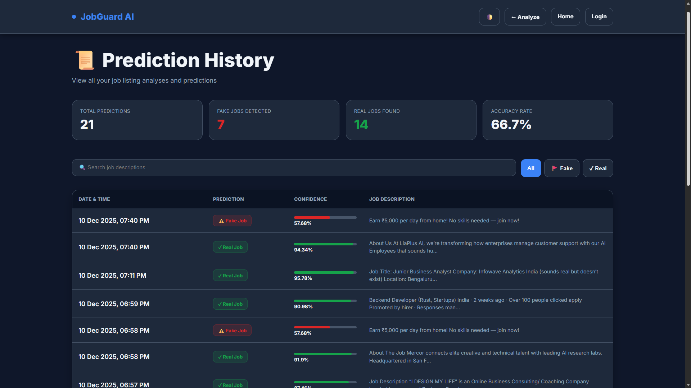

# JobGuard AI: Fake Job Posting Detection

**JobGuard AI** is a modern web app that detects fraudulent job postings using Machine Learning. Built with **Flask**, **SQLite**, and a clean responsive UI with an **admin dashboard** and **analytics**.

**🌐 Live Demo:** https://jobguard-ai.up.railway.app/

---

## 🖼️ Product Tour

Here’s a quick look at the app experience — from landing to predictions, history, and admin analytics.

### Landing Page

Clean landing page with key stats (total predictions + fake/real counts) and quick navigation to start analyzing a job description.


### Prediction

Paste a job description and get an instant classification (**Fake Job** / **Real Job**) with a confidence score.



### History

Every prediction is stored in SQLite so you can review past checks and track what the model has flagged over time.



### Admin Dashboard

Admin-only analytics view with Chart.js visualizations (daily volume + fake/real distribution) and retraining activity logs.


---

## 🎯 What This Project Does

JobGuard AI helps job seekers identify scam postings by analyzing text patterns that show up frequently in fraudulent listings, such as:
- Exaggerated salary claims
- Vague responsibilities
- Upfront payment requests
- Too-good-to-be-true offers

<<<<<<< HEAD
It’s built around one simple flow: **paste job description → validate → predict → log to database → visualize analytics**.

---

## ✨ Core Features

- **✅ Real-time analysis** with confidence scores
- **✅ Prediction history** stored in SQLite (audit trail)
- **✅ Admin dashboard** with interactive charts (Chart.js)
- **✅ Session-based admin authentication**
- **✅ Retraining logs** (tracks retraining activity in the UI)
- **✅ Dark/Light theme** with persistent preference
- **✅ Responsive UI** (mobile/tablet/desktop)
=======
**Core Features:**
- ✅ Real-time job listing analysis with confidence scores
- ✅ Prediction history with search & filtering
- ✅ Admin dashboard with interactive charts & analytics
- ✅ Model retraining with custom datasets
- ✅ Dark/Light theme with persistent storage
- ✅ Session-based authentication for admins
- ✅ SQLite database for audit trails
- ✅ Responsive design (mobile, tablet, desktop)
- ✅ Modern UI with smooth animations
>>>>>>> bae43a3bf04eba41ba1d2cbf6b8384d5301f41fe

---

## 👥 Who Is This For?

Perfect for learning/building:
- **Data Science**: text cleaning, TF‑IDF vectorization, model evaluation
- **Backend**: Flask routes, JSON endpoints, session auth
- **Database**: SQLite schema + logging + aggregation
- **Frontend**: modern templates, theme toggles, Chart.js dashboards
- **Deployment**: Gunicorn, Docker, Railway

---

## 🛠 Tech Stack

### Backend
- **Flask**
- **scikit-learn**
- **joblib**
- **SQLite**
- **gunicorn**

### Frontend
- **Jinja2 templates**
- **Chart.js** (dashboard charts)

---

## 📁 Project Structure

```text
Infosys-ISpringboard/
├── app.py                          # Flask server & routes
├── fake_job_pipeline.py            # ML training pipeline
├── predict_example.py              # Quick inference sample
├── fake_job_postings.csv           # Dataset
├── requirements.txt                # Python dependencies
├── Dockerfile                      # Container build
├── Procfile                        # Gunicorn entry (Railway/Heroku style)
├── railway.json                    # Railway config
├── Public/                         # Screenshots
└── templates/
    ├── home.html                   # Landing page
    ├── index.html                  # Job analysis form
    ├── result.html                 # Prediction results
    ├── history.html                # Prediction history
    ├── login.html                  # Admin login
    ├── dashboard.html              # Admin analytics
    └── retrain_logs.html           # Training history view
```

---

## 🚀 Quick Start

### 1) Prerequisites

- Python 3.11+
- pip

### 2) Install dependencies

```bash
python -m venv .venv

# Windows
.\.venv\Scripts\activate

# macOS/Linux
source .venv/bin/activate

pip install -r requirements.txt
```

### 3) Train the model (first time only)

```bash
python fake_job_pipeline.py
```

This generates:
- `fake_job_model.pkl` – trained classifier
- `tfidf_vectorizer.pkl` – saved TF‑IDF vectorizer

### 4) Start the web app

```bash
python app.py
```

Open: http://127.0.0.1:5000/

---

## 🔐 Admin Access

**Default credentials (demo):**
- **Username:** `admin`
- **Password:** `password123`

⚠️ Change these before deploying a real version.

---

## 📖 Using the Interface

### 🏠 Public Pages (No Login Required)

**Home** (`/`)
- Landing page with basic stats (total predictions, fake/real counts)

**Analyze** (`/predict_form`)
- Paste a job description (validation rules apply)
- Get instant prediction + confidence

**History** (`/history`)
- View all past predictions (newest first)

### 🔑 Admin Pages (Login Required)

**Dashboard** (`/admin_dashboard`)
- Key metrics (total/fake/real)
- Time-series volume chart
- Fake vs Real distribution

**Training Logs** (`/retrain_logs`)
- Shows recorded retrain attempts and accuracy trend chart

---

## 🌐 API Routes

| Route | Method | Auth | Purpose |
|-------|--------|------|---------|
| `/` | GET | No | Landing page |
| `/predict_form` | GET | No | Analysis form |
| `/predict` | POST | No | Predict (returns JSON) |
| `/history` | GET | No | Prediction history |
| `/admin_login` | GET/POST | No | Admin login |
| `/admin_dashboard` | GET | Yes | Analytics dashboard |
| `/retrain_logs` | GET | Yes | Training history |
| `/retrain` | POST | Yes | Record retrain activity |
| `/logout` | GET | Yes | Logout |

---

## 💾 Database Schema

SQLite DB file: `job_predictions.db` (auto-created).

**`predictions` table:**

```sql
id (INTEGER) | job_description (TEXT) | prediction (TEXT) | confidence (REAL) | timestamp (DATETIME)
```

**`admin` table:**

```sql
id (INTEGER) | username (TEXT) | password (TEXT)
```

**`retrain_logs` table:**

```sql
id (INTEGER) | accuracy (REAL) | timestamp (DATETIME) | training_source (TEXT)
```

---

## 📊 How Predictions Work

1. **Input**: user submits job description
2. **Validation**: minimum words and alphabetic content checks
3. **Vectorization**: TF‑IDF converts text into numeric features
4. **Prediction**: Logistic Regression estimates probability
5. **Result**: label + confidence are returned to UI
6. **Logging**: the prediction is stored in SQLite

---

## 🔧 Configuration

### Change Timezone

Update the timezone conversion inside `format_time()` in `app.py`.

### Change Accuracy Badges

The admin UI uses thresholds in templates for “Excellent/Good/Fair” type badges. Adjust them in `dashboard.html` / `retrain_logs.html` to match your preference.

---

## 🐛 Troubleshooting

| Issue | Likely Cause | Fix |
|------|--------------|-----|
| Model files missing | First run / artifacts deleted | Run `python fake_job_pipeline.py` |
| `ModuleNotFoundError` | Missing package | `pip install -r requirements.txt` |
| Database errors | Corrupt DB file | Delete `job_predictions.db` and restart |
| Wrong time display | Timezone mismatch | Update timezone in `format_time()` |
| Charts not showing | JS errors | Check browser console for errors |

---

## 🚀 Deployment

**Currently deployed on Railway:** https://jobguard-ai.up.railway.app/

### Docker

```bash
docker build -t jobguard-ai .
docker run -p 5000:8000 jobguard-ai
```

---

## 🔐 Security Notes

For production:
- Hash passwords (don’t store plaintext)
- Move secrets to environment variables
- Add CSRF protection for admin forms
- Add rate limiting

---

## 📚 Learning Resources

- Flask: https://flask.palletsprojects.com/
- scikit-learn: https://scikit-learn.org/
- SQLite: https://www.sqlite.org/
- Chart.js: https://www.chartjs.org/

---

## 🔄 Extending the Project

Easy additions:
- Add export to CSV for prediction history
- Add user accounts (not just admin)
- Improve retraining workflow (connect UI retrain to actual pipeline)

Advanced additions:
- Replace TF‑IDF with modern NLP embeddings (e.g., DistilBERT)
- Add feedback loop for false positives/negatives
- Add monitoring/drift detection

---

## 📝 License

This project is licensed under the **MIT License** - see the [LICENSE](LICENSE) file for details.

**Copyright © 2026 Manan**

---

## 👨‍💻 Author

<<<<<<< HEAD
Built by Manan.
=======
1. **Start Simple:** Understand the basic flow before customizing
2. **Test Manually:** Try different job descriptions to see how model reacts
3. **Monitor Logs:** Check timestamp logs to understand prediction patterns
4. **Experiment:** Retrain with different datasets to improve accuracy
5. **Share:** Show it to friends and get feedback on UI/UX
6. **Deploy:** Once confident, deploy to cloud for others to use

---

## 🙋 FAQ

**Q: Can I use my own training data?**
A: Yes! Modify `fake_job_pipeline.py` to load your CSV/dataset instead of hardcoded samples.

**Q: How accurate is the model?**
A: Depends on training data quality. Current model achieves ~93-97% accuracy (see dashboard).

**Q: Can I change the prediction threshold?**
A: Yes, edit `app.py` in the `/predict` route:
```python
label = "Fake Job" if prob > 0.6 else "Real Job"  # Change from 0.5
```

**Q: Is this production-ready?**
A: It's a great foundation! Add security hardening before real deployment.

**Q: How do I add more features?**
A: Modify `fake_job_pipeline.py` to include additional text features, then retrain.

---

**Made with ❤️ using Flask + ML + Modern UI Design**

Start analyzing fake jobs today! 🚀
>>>>>>> bae43a3bf04eba41ba1d2cbf6b8384d5301f41fe
